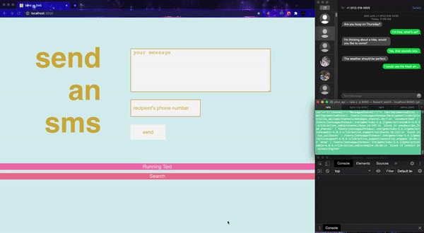

# Send an SMS -- Client
___
Welcome! 

Before starting, make sure you have already set up the back-end located [here](https://github.com/Josh-Gotro/Plivo_api). Most of the heavy lifting for setting up this app is for the back-end. 

Once that has been completed, follow the instructions below and soon you will be up and running.

___
## Preview


___
## Features
- Send and Recieve texts using the Plivo Messaging API
- Receive Texts in real-time using webhooks and disply to the client
- View historical logs of incoming & outgoing messages via user-selceted date/time using Plivo API
- Responsive to desktop and mobile views. 
___
## Dependancies
*If you don't have this installed, follow the links to find instructions.* 
 - [Node.js & npm](https://www.npmjs.com/get-npm)
___
## Setup
 *Install app and start server*
- Clone this repository and navigate into the directory. 
- Run the following four commands from your terminal:
```
npm i
```
```
npm start
```
___
***
***
***Congrats! You are now ready to use the site.***

Notes:

- All messages sent through the browser will be sent from your Plivo phone number. 
- When entering phone number for the recipient, only include integers and include the country code and area code. 

***
***
___
# About
## Technologies Used in This Project
**Plivo Messaging API**
- Send Text
- Recieve Text in Real Time
- Retrieve Records by Date-range

**Rails 6 (back-end)**
- JSON API 
- Action Cable Web Sockets
- Encrypted Secrets 

**React (front-end)**
- [React Hook Form](https://react-hook-form.com/)
- [Actioncable Provider](https://www.npmjs.com/package/react-actioncable-provider)

**Ngrok**
- Expose Localhost Server to the Internet
- Use Ngrok to Set Webhooks That Talk to Plivo Server
___
## Contact Me


[Email](joshuagauthreaux@gmail.com)

[LinkedIn](https://www.linkedin.com/in/josh-gauthreaux/)

[Portfolio](https://www.joshgotro.com)

[Medium](https://medium.com/@joshuagauthreaux)